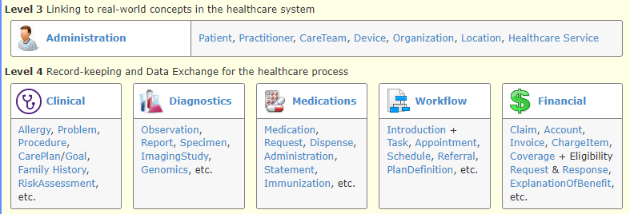
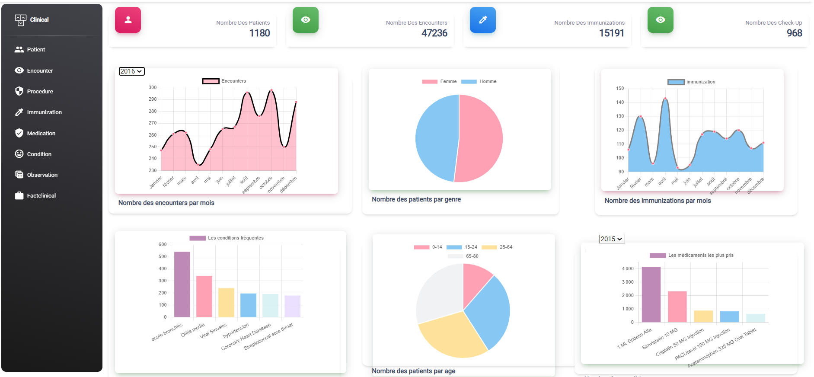

# 🏥 Healthcare Data Mesh – End-of-Degree Internship

##  Project Overview

This project was completed as part of my **National Bachelor's degree in Computer Science, specializing in Big Data and Data Analysis**, during my **End-of-Degree Internship at IT Progress Tunis,Tunisia** from **February 2023 to May 2023**.

The goal was to design and implement a **Data Mesh architecture** leveraging [**HL7 FHIR**](https://www.hl7.org/fhir/) (Fast Healthcare Interoperability Resources) standards to enable secure, scalable, and interoperable healthcare data management. 

This architecture organized data into three autonomous domains:

* **Clinical**
* **Individuals**
* **Financial**

To deliver real value to medical professionals, the project also included the development of a **secure web application** that:

* Provides **patient management** features with electronic medical records.
* Offers **interactive dashboard** to monitor patient health indicators and clinical metrics.
* Integrates a **medication recommendation system** to support doctors with data-driven treatment suggestions.

## 🛠️ Key Contributions

* **Data Mesh Implementation:** Designed a scalable Data Mesh architecture with clear domain boundaries, ensuring data ownership and governance.
* **Interoperability:** Applied **HL7 FHIR standards** to facilitate seamless communication between healthcare systems and applications.
* **Data Pipelines:** Built automated **ETL pipelines** using Python for cross-domain data processing and synchronization.
* **Domain Data Products:**

  * **Individuals Domain:** Implemented in **Neo4j (graph database)** to map relationships between patients, Organization, Practitioner,and Geographie.
  * **Clinical & Financial Domains:** Designed in **PostgreSQL** to host clinical data and financial information, connected to the web application.
* **Web Application Development:** Delivered a professional-grade platform for healthcare professionals combining patient records, dashboards, and the medication recommendation engine.

##  Medication Recommendation System

The recommendation engine assists healthcare professionals by suggesting medications based on patient medical histories and doctor-prescribed treatments in similar cases. Two complementary approaches were implemented using **scikit-learn**:

1. **Vectorization-based Recommendation:** Patient data and medication history are transformed into numerical vectors to measure similarity and recommend relevant treatments.
2. **Interaction Matrix-based Recommendation:** A patient-medication interaction matrix is built, enabling collaborative filtering algorithms to predict suitable medications.

These methods allow the system to uncover actionable insights from historical clinical data, improving the precision and relevance of recommendations.

## 📚 Tools & Technologies

* **Architecture:** Data Mesh, HL7 FHIR
* **Databases:** Neo4j, PostgreSQL
* **ETL & Data Processing:** Python, Pandas, SQL
* **Web Application:** Secure web app for doctors and medical professionals
* **Dashboards & Analytics:** Interactive dashboards, advanced analytics
* **Machine Learning:** Recommendation algorithms using scikit-learn

## 📂 Project Structure

1. **Individuals Domain:** Neo4j graph database capturing relationships between patients, doctors, and healthcare facilities.
2. **Financial Domain:** PostgreSQL domain focused on managing financial data.
3. **Clinical Domain:** PostgreSQL domain integrated into the web app, featuring dashboards, electronic patient records, and the medication recommendation assistant.

## 🔐 Confidentiality

Due to the use of **sensitive healthcare data**, real datasets and production-ready code are **not included**. This repository only contains anonymized examples and high-level diagrams for illustrative purposes.

## 👨‍💻 Author

Project developed by **Nada Ammar** during the **End-of-Degree Internship at IT Progress**, as part of the **National Bachelor's degree in Computer Science (Big Data & Data Analysis)**.

